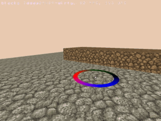

## [commit 4676b32138b12f446e55c2296ed170c8573e0b87](https://github.com/mickvangelderen/blocks-rust/commit/4676b32138b12f446e55c2296ed170c8573e0b87)

Render geometry into color and depth buffers, then render a fullscreen quad and
calculate the fragment position in camera space from the depth, the view
frustrum and the fragment's xy position.

This allows some pretty neat effects. Did the same calculation for the mouse and tested if a fragment was within a sphere to create the following effect.

