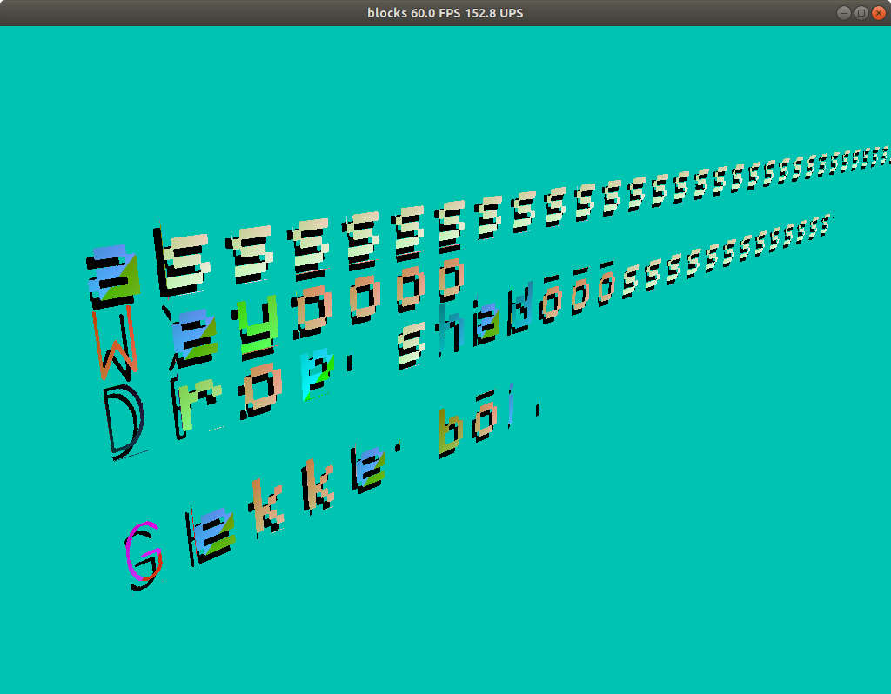
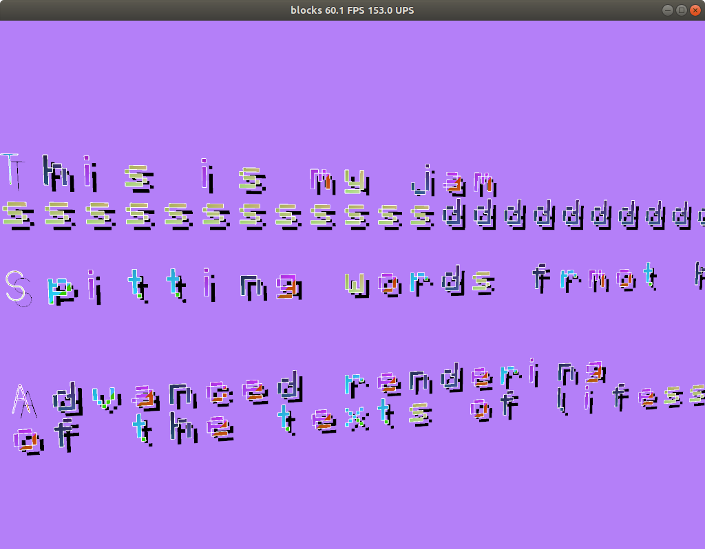

## [commit 1079f09df9d917fe46b0614c2caff6b4643a700c](https://github.com/mickvangelderen/blocks-rust/tree/1079f09df9d917fe46b0614c2caff6b4643a700c)

Implemented basic text rendering. Using instanced rendering to render each
glyph. The texture coordinates for each glyph are determined by the character
value:

```glsl
uint row = vs_char/16;
uint col = vs_char - 16*row;
vec2 tex_offset = vec2(float(col)/16.0, float(15 - row)/16.0);
fs_tex_pos = vs_tex_pos + tex_offset;
```

Not sure if I can make the blocky letters look nice without multisampling. Needs
at least pre-alpha blending and selecting the right texture filtering modes.

I took this after getting the code to run the first time. It might not look good
but the fact that it displayed something was a huge win. The problem was easy to
fix too because the right letters were being rendered only the +u and +v texture
coordinates were too large, they needed to be scaled down by the number of
glyphs in my texture.


This is the font texture, you won't see much on a white background though.


Here is the working result.


This is the result when turning on 16x multisampling.


## [commit df929c767b575765c861f6c52e8112a2beab4f34](https://github.com/mickvangelderen/blocks-rust/commit/df929c767b575765c861f6c52e8112a2beab4f34)

Render text using a [signed distance
field](http://www.valvesoftware.com/publications/2007/SIGGRAPH2007_AlphaTestedMagnification.pdf).
Not sure if my implementation is exactly what is described in the paper because
I just went with what I thought was good, and that seemed to work.



Applied padding (larger than the maximum distance) before calculating the SDF so
that the glyphs do not influence eachother.


